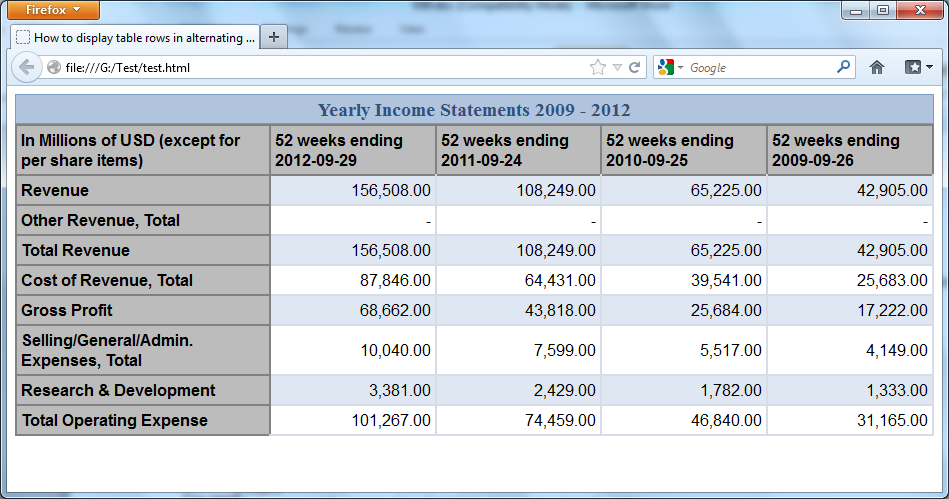

# Лабораторная работа 3. Адаптивная вёрстка

> [!NOTE]
> Может дополняться

В этой лабораторной работе необходимо грамотно сверстать страницу, полученную в результате выполнения прошлых работ.

Необходимо расположить все ранее описанные элементы вашего сайта в соответствии с макетом, используя [Flexbox](https://developer.mozilla.org/ru/docs/Learn_web_development/Core/CSS_layout/Flexbox) и/или [Grid](https://developer.mozilla.org/ru/docs/Learn_web_development/Core/CSS_layout/Grids), а также [медиазапросы CSS](https://developer.mozilla.org/ru/docs/Web/CSS/CSS_media_queries/Using_media_queries).

Требования к работе:

1. Обязательно наличие горизонтальных и вертикальных рядов элементов (галерея с картинками, подборка новостей и т.п.). Если таких элементов нет, их всегда можно придумать :)
2. Необходимо проработать, как ваш макет будет выглядеть на различных устройствах и разрешениях (смартфон, ноутбук с разрешением Full HD, монитор с разрешением WQHD, широкоформатный монитор с соотношением сторон 21:9).
3. Какие-то элементы не должны отображаться на маленьких мониторах, например, рекламный баннер во всю ширину футера.
4. Один из элементов на странице (шапка, подвал, окно чата и т.д.) должен быть закреплён с помощью абсолютного либо sticky-позиционирования.
5. На странице должна быть таблица со строкой-заголовком и разными стилями для чётных и нечётных строк. В качестве типа отображения таблицы нужно воспользоваться grid-сеткой для достижения лучшей адаптивности (т.е. необходимо добиться того, чтобы колонки таблицы изменяли свой размер в зависимости от размера окна). При этом семантически таблица должна остаться таблицей с использованием тега `<table>` и сопутствующих ему.

