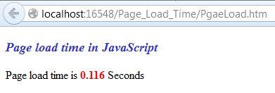
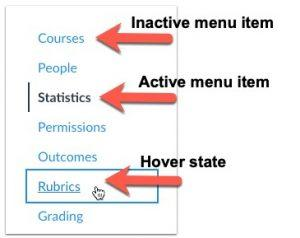

# Лабораторная работа 4. Добавление пользовательского интерактивного взаимодействия

Цель лабораторной работы — научится взаимодействовать с элементами и браузером, используя язык программирования JavaScript.

Что нужно сделать:

1. Добавьте новые страницы для вашего проекта. Как минимум, должны появиться все страницы, указанные в навигации по сайту.
2. Создайте скрипт, который будет выполняться на каждой странице, добавьте его в отдельную папку и подключите в разделе `<head>` на каждой странице.
3. Используя IIFE, подпишитесь на события загрузки страницы и выведите в подвал информацию о времени загрузки.

4. Добавьте интерактивности навигации: обработайте события наведения мыши на конкретные пункты с использованием CSS (без JS). Пункт со звёздочкой: сделайте плавное изменение внешнего вида пункта навигации при наведении мыши.
5. В зависимости от того, на какой странице находится пользователь (можно понять по `document.location`), добавьте соответствующему пункту меню CSS-класс, отвечающий за «активное» состояние (см. пример).

Требования к реализации:

1. Реализация обработки событий должна оставлять возможность добавлять новые обработчики для одного и того же события;
2. Время загрузки, выводимое на странице, должно быть как можно ближе ко времени, указанному во вкладке «Сеть» средств разработчика.
3. Текущая страница должна подсвечиваться в навигации именно с помощью JS, вариант, когда для каждой страницы вы в разметке указываете класс, не подходит.
4. Продумайте сценарий, когда у вас в навигации есть ссылки на две разные страницы с одним и тем же названием файла, но разными путями.
